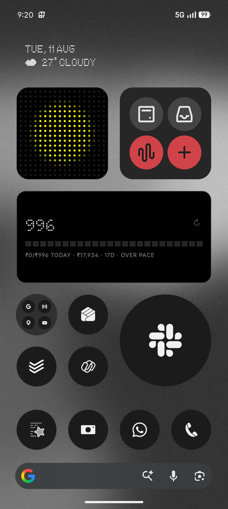
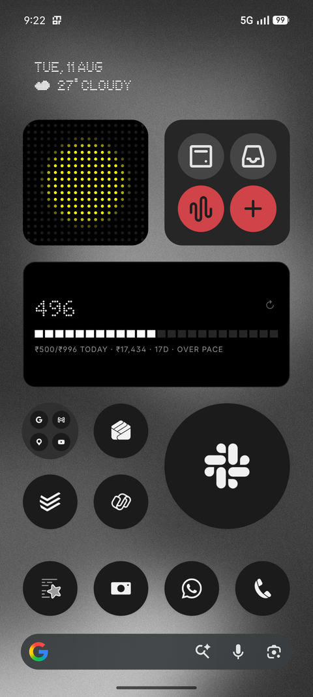
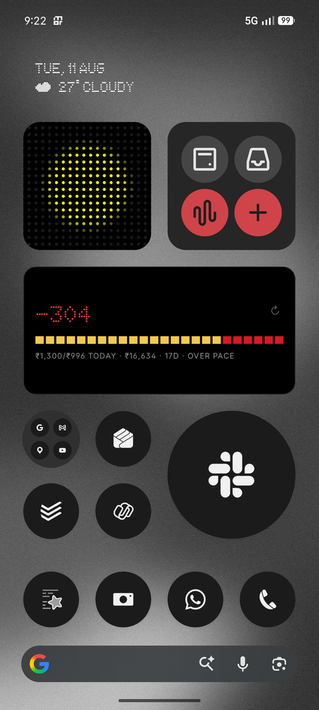
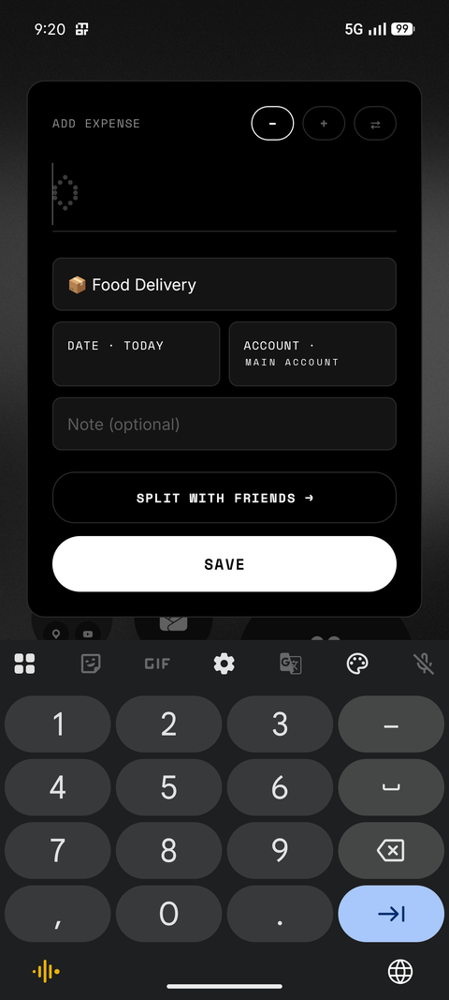
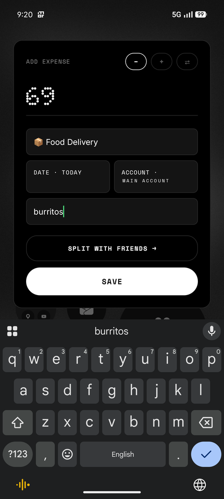
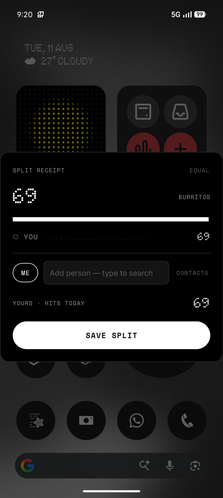
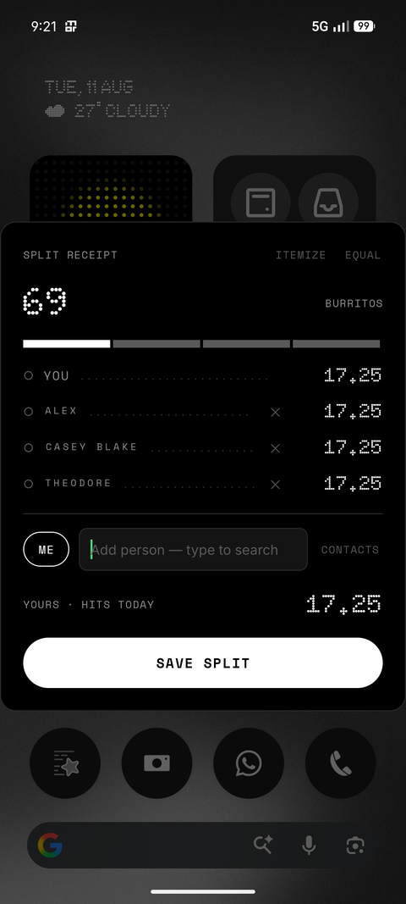
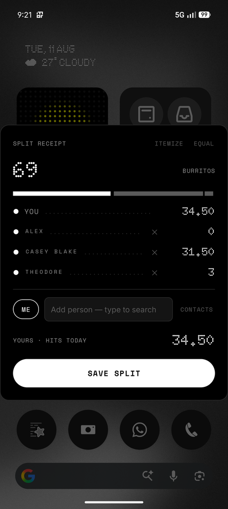

# lunchwidget

An Android home-screen widget for [Lunch Money](https://lunchmoney.app) that
answers one question at a glance — **how much can I still spend today?** — and
lets you log an expense in two taps without opening an app.

Built as a companion to [dailyspend](https://github.com/SauravSuresh/dailyspend),
which computes the same number server-side and drops it into Todoist every
morning. This widget computes it on-device, live.

<p>
  
  
  
  
</p>

The bar fills as the day goes: white while there's room, amber past 70%, red
once today is blown and the hero number goes negative. Tomorrow quietly shrinks
to compensate.

## The philosophy: a daily number, not a monthly one

Lunch Money budgets monthly. But nobody overspends a month at a time — you
overspend one lunch, one cab, one impulse buy at a time. A monthly budget is
too big and too far away to change any single decision.

So the widget collapses the month into **one adaptive daily allowance**:

```
today's allowance = (budget − spent before today) ÷ days left in period
```

The number self-corrects. Overspend today and tomorrow's allowance shrinks;
underspend and it grows. There's no streak to break, no guilt mechanic —
just an honest number that absorbs yesterday and re-plans the rest of the
period every morning.

The widget shows what's left of *today's* share, with a segmented bar that
fills left to right as you spend it. Glanceable pacing: white means go,
amber means you've used 70%, red means today is blown (and tomorrow will
quietly shrink to compensate).

## Quick add, because friction kills tracking

The other half of the loop: an expense you don't log is an expense the
number doesn't know about. Opening an app, waiting for sync, filling a form —
that's enough friction to skip logging the ₹40 chai, and enough skipped
chais makes the allowance fiction.

So the whole widget is a button. Tap → amount → category (type-to-search,
sorted by what you've used recently) → save. The transaction posts to Lunch
Money, the allowance recomputes, and the bar moves — immediately. Logging an
expense costs about four seconds, which is cheap enough to actually do.

Note and tags are optional. The tag field is comma-separated and autocompletes
against the tags already in your Lunch Money, so a typo doesn't quietly create a
new one; the `owed:<person>` tags the split flow manages are kept out of the
list. Tags ride along onto every share of a split.

<p>
  
  
</p>

## Splits and money coming back

Group bills get a receipt-style split step: pick people (typed, remembered, or
from contacts), shares split equally, edit any share and the rest snap to
rebalance. Only **your** share counts against today's number — the rest posts
to an excluded Reimbursements category in Lunch Money, tagged per person
(`owed:alex`), so friends' portions never pollute your budget.

<p>
  
  
  
</p>

Left to right: the split step as it opens, four ways equally, then after
editing — locked rows hold and the unlocked ones snap to absorb the difference.

When someone pays you back, flip the quick-add to `+`: pick the person, enter
what you received, and the amount pours over their pending items oldest-first —
partial payments just leave the remainder pending. One negative tagged
transaction posts; Lunch Money remains the source of truth — the widget keeps
only an encrypted local cache of the pending ledger for offline/display use,
rebuilt from Lunch Money on every refresh.
General income takes the same `+` path into your income categories. Full
design: [docs/spec-income-split.md](docs/spec-income-split.md).

Moving money between your own accounts is the third chip, `⇄`: amount, from,
to. It posts two transactions into Lunch Money's own `Payment, Transfer`
category, which already excludes itself from budget and totals — so a transfer
never moves the daily number.

## Nothing style

I use a Nothing phone, so the widget dresses like it belongs there: OLED
black, dot-matrix hero number ([Doto](https://fonts.google.com/specimen/Doto),
round dots — the open cousin of NDot), ALL-CAPS Space Mono labels, and a
discrete segmented bar instead of a smooth progress fill. Monochrome
everywhere; red (#D71921) appears only as a signal, when today's limit is
actually exceeded. Design follows
[nothing-design-skill](https://github.com/dominikmartn/nothing-design-skill)
and [vibe-nothing-ui-design](https://github.com/wangbh030722/vibe-nothing-ui-design).

## Install

```sh
./gradlew assembleDebug
adb install app/build/outputs/apk/debug/app-debug.apk
```

Open **Lunch Widget** → paste your Lunch Money API token (lunchmoney.app →
Developers) → Save → add the widget to your home screen.

No Play Store, no server, no analytics. One API token, stored locally,
talking straight to `dev.lunchmoney.app`. Zero third-party runtime
dependencies beyond AndroidX WorkManager.

## Settings

- **Tracked categories** — comma-separated, default `Living Expenses`.
  A category group includes all its children.
- **Period start day** — default `29` (salary-cycle months, 29th–28th);
  `1` for calendar months.
- **Currency symbol** — display only, default `₹`.
- **Reimbursements category** — default `Reimbursements`; looked up by name at
  the first split and created (excluded from budget and totals) if missing.
  Point it at an existing category to reuse it — its exclude flags get fixed.
- **Show the date picker on quick add** — default on. A `DATE · TODAY` chip on
  every entry screen, tap to backfill (future dates are blocked). Turn it off and
  the chip disappears everywhere and everything posts today — this is a quick add
  first, and most adds are for right now.
- **Default account for quick add** — which Lunch Money account a new
  transaction lands in. Every screen that posts money has an `ACCOUNT` chip
  seeded from this, so the default is a starting point, not a lock. Manual
  accounts only (Lunch Money won't accept transactions into a Plaid-linked
  one); investments sort last.

## Security

The API token is full read/write on your Lunch Money account, so it doesn't
sit in plaintext anywhere:

- **Sealed at rest.** The token, the people list, and the pending ledger are
  encrypted with AES/GCM under a key generated inside the **Android Keystore**,
  which never leaves it. `adb backup`, `run-as` on a debug build, and an offline
  image of the flash all yield ciphertext. Values written before this shipped
  are re-sealed in place on first read. No new dependency — it's the platform
  Keystore through `javax.crypto`.
- **Never re-displayed.** After you save it, Settings shows `Saved · ••••3f2a`
  and an empty field; leave the field blank to keep the saved token, type to
  replace it. The field itself is `textPassword` with autofill off, and Settings
  sets `FLAG_SECURE` — no screenshots, no screen recording, no recents thumbnail.
- **Nothing leaves the device.** `allowBackup="false"` plus data-extraction
  rules that exclude every domain, so neither cloud backup nor Android 12+
  device-to-device transfer copies the app's data. Quick add is
  `exported="false"` — only the widget's own PendingIntent can open it.
  Cleartext HTTP is already blocked by the targetSdk 34 default.

One gap left by choice: the sideloaded APK is a **debug** build, so `run-as`
and debugger attach still work if USB debugging is on and the phone is
unlocked (the data is ciphertext either way). To close it, sign a release
build:

```sh
keytool -genkeypair -v -keystore ~/lunchwidget.jks -alias lunchwidget \
  -keyalg RSA -keysize 4096 -validity 10000
./gradlew assembleRelease   # then zipalign + apksigner with that key
```

Keep the keystore — without it you can't upgrade in place, only uninstall
and reinstall, which wipes the token and settings.

## How it works

Every 4 hours — and instantly after each quick-add or a tap on ↻ — a
WorkManager job pulls categories, budgets, and the period's transactions,
recomputes the allowance, caches a snapshot, and redraws the widget. While the
sync is in flight the ↻ swaps for a spinner. Offline it renders the last
snapshot with a STALE marker.

Writes go through WorkManager too. Pressing save shows a one-line receipt with
**UNDO** for four seconds; nothing has reached Lunch Money yet, so undo simply
drops it (the v1 API can't delete a transaction, so a real undo has to be one
that never sent). When the window closes the transaction is queued with a
network constraint and exponential backoff — log an expense in a lift and it
posts itself when there's signal. Leaving the dialog commits; only UNDO
cancels. Transactions post as reviewed (cleared), dated today unless you pick
another date.

```sh
./gradlew test   # unit tests for the allowance math
```
